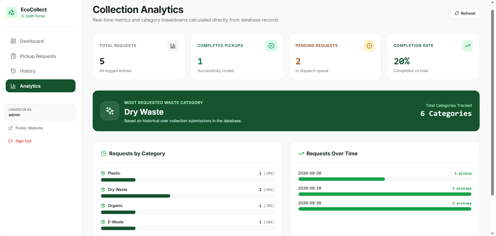

# 🌱 EcoCollect

### Waste Collection Request & Tracking Platform

EcoCollect is a simple civic-tech web platform designed to make waste collection more organized and easier to access.

Users can identify their waste category, submit a pickup request, select a convenient pickup schedule, and track the request status. Collection staff can manage incoming requests through a dedicated administrative dashboard with search, filtering, history, and collection statistics.

---

## 🎯 Problem

People often face difficulty understanding how to dispose of different types of waste or where to request an appropriate collection service.

At the same time, collection services may have difficulty:

* Organizing incoming pickup requests
* Tracking request status
* Finding specific requests quickly
* Maintaining pickup history
* Monitoring collection activity

EcoCollect addresses this gap with a single, structured digital workflow.

---

## 💡 Solution

EcoCollect connects the user request process with collection management through a simple web application.

### User

**Choose Waste → Enter Pickup Details → Schedule → Submit → Track**

### Collection Staff

**Login → View Requests → Search / Filter → Update Status → Monitor History & Analytics**

The platform focuses on the core workflow required for a practical waste collection MVP rather than adding unnecessary complexity.

---

# ✨ Key Features

## 👤 User Side

### ♻️ Waste Category Selection

Users can choose from six waste categories:

* Plastic
* Dry Waste
* Organic
* E-Waste
* Hazardous
* Other

### 📍 Pickup Location

Users provide the location where the waste should be collected.

### 📅 Pickup Scheduling

Users can select:

* Pickup date
* Available pickup time slot
* Additional notes

Past pickup dates are prevented through validation.

### 📝 Pickup Request

The request process follows a simple three-step flow:

1. Choose waste category
2. Enter pickup information
3. Review and confirm

After submission, the system generates a unique request ID.

Example:

```text
EC-2026-00483
```

### 🔎 Request Tracking

Users can track their request using the request ID and view its current status through a visual timeline.

### 📋 My Requests

Users can view their requests and filter them by status.

---

# 🛠️ Admin Dashboard

The administrative portal provides collection staff with tools to manage pickup requests.

### Dashboard

Provides an overview of:

* Total requests
* Pending requests
* Confirmed requests
* Scheduled requests
* Collected requests
* Cancelled requests
* Completion rate
* Collection activity

### Request Management

Administrators can:

* View pickup requests
* Search requests
* Filter by category
* Filter by status
* Filter by date
* Open request details
* Update request status

### Request Status

The primary workflow is:

```text
Pending
   ↓
Confirmed
   ↓
Scheduled
   ↓
Collected
```

Requests can also be marked as:

```text
Cancelled
```

### Pickup History

Completed and cancelled requests are available in a dedicated history section.

### Analytics

The analytics section provides:

* Collection activity
* Category distribution
* Completion rate
* Request statistics

---

# 🔄 Application Workflow

```text
                    ECOCOLLECT
                         │
              ┌──────────┴──────────┐
              │                     │
            USER                  ADMIN
              │                     │
              ▼                     ▼
       Choose Waste             Admin Login
              │                     │
              ▼                     ▼
       Pickup Location         Dashboard
              │                     │
              ▼                     ▼
       Select Date/Time       View Requests
              │                     │
              ▼                     ▼
       Review Request         Search / Filter
              │                     │
              ▼                     ▼
       Submit Request         Update Status
              │                     │
              ▼                     ▼
        Request ID              Analytics
              │                     │
              ▼                     ▼
       Track Pickup            History
```

---

# 🖼️ Screenshots

## Home


## Request a Pickup


## Request Confirmation


## Request Tracking


## Admin Dashboard


## Request Management


## Analytics



---

# 🧰 Technology Stack

## Frontend

* React
* TypeScript
* Vite
* Tailwind CSS
* Lucide React

## Backend

* Python
* FastAPI
* Pydantic
* SQLAlchemy

## Database

* SQLite

## Deployment

* Docker
* Google Cloud Run

## Version Control

* Git
* GitHub

---

# 🏗️ Project Structure

```text
EcoCollect/
│
├── backend/
│   ├── app/
│   │   ├── models/
│   │   │   └── pickup_request.py
│   │   │
│   │   ├── routes/
│   │   │   ├── admin.py
│   │   │   └── requests.py
│   │   │
│   │   ├── schemas/
│   │   │   ├── auth.py
│   │   │   ├── request.py
│   │   │   └── stats.py
│   │   │
│   │   ├── services/
│   │   │   ├── request_service.py
│   │   │   └── seed_service.py
│   │   │
│   │   ├── utils/
│   │   │   └── auth.py
│   │   │
│   │   ├── config.py
│   │   ├── database.py
│   │   └── main.py
│   │
│   ├── tests/
│   │   ├── test_api.py
│   │   └── verify_scenario.py
│   │
│   └── requirements.txt
│
├── frontend/
│   ├── src/
│   │   ├── components/
│   │   ├── context/
│   │   ├── pages/
│   │   │   └── admin/
│   │   ├── services/
│   │   ├── types/
│   │   ├── App.tsx
│   │   ├── index.css
│   │   └── main.tsx
│   │
│   ├── package.json
│   ├── package-lock.json
│   ├── tailwind.config.js
│   ├── tsconfig.json
│   └── vite.config.ts
│
├── screenshots/
│   ├── home.png
│   ├── Request a Pickup.png
│   ├── Request Confirmation.png
│   ├── Request Tracking.png
│   ├── Admin Dashboard.png
│   ├── Request Management.png
│   └── Analytics.png
│
├── Dockerfile
├── .dockerignore
├── .gitignore
├── pytest.ini
├── walkthrough.md
└── README.md
```

---

# 🔌 API

## Health

```http
GET /health
```

## Pickup Requests

```http
POST /api/requests
GET /api/requests
GET /api/requests/{request_id}
PATCH /api/requests/{request_id}/status
```

## Admin

```http
POST /api/admin/login
GET /api/admin/statistics
GET /api/admin/category-statistics
GET /api/admin/history
GET /api/admin/analytics
```

FastAPI also provides interactive API documentation through:

```text
/docs
```

---

# 🛡️ Validation

EcoCollect includes backend validation for important request fields.

The application prevents:

* Empty required fields
* Invalid waste categories
* Invalid pickup information
* Past pickup dates

Validation errors are presented using clear, user-friendly messages rather than technical error details.

---

# 🧪 Testing

The project includes automated backend tests for the main application workflow.

Tests cover:

* Health check
* Initial demo data
* Empty category validation
* Past-date validation
* Pickup request creation
* Request ID generation
* Status progression
* Admin authentication
* Dashboard statistics
* Category statistics
* Pickup history

Run the tests with:

```bash
pytest
```

The end-to-end verification scenario covers the complete workflow:

```text
Create Request
      ↓
Pending
      ↓
Confirmed
      ↓
Scheduled
      ↓
Collected
      ↓
Pickup History
```

---

# 🗄️ Database

The MVP uses SQLite with SQLAlchemy.

The pickup request stores information including:

* Request ID
* Waste category
* Pickup address
* Pickup date
* Pickup time
* Notes
* Status
* Created timestamp
* Updated timestamp

SQLite keeps the hackathon MVP lightweight and simple to run.

For a larger production deployment, the database can be migrated to PostgreSQL / Google Cloud SQL.

---

# 🐳 Docker

EcoCollect includes a Docker configuration for deployment.

Build the application:

```bash
docker build -t ecocollect .
```

Run locally:

```bash
docker run -p 8080:8080 ecocollect
```

The container is configured to use the deployment environment's `PORT` value.

---

# ☁️ Google Cloud Run

EcoCollect is designed to be deployed using Google Cloud Run.

The Docker setup builds the frontend an
