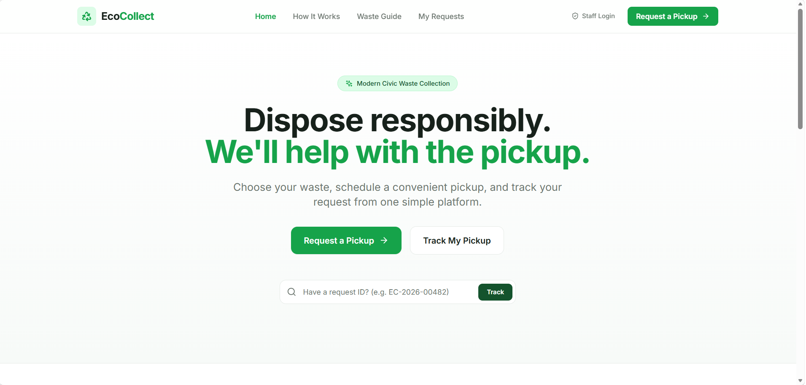

# 🌱 EcoCollect

### Simple waste collection, organized.

EcoCollect is a civic-tech web platform that makes waste collection requests easier to submit, schedule, manage, and track.

People often face difficulty understanding how to dispose of different types of waste or where to request appropriate waste collection services. At the same time, collection services can struggle to organize pickup requests and keep track of their status.

EcoCollect brings the complete workflow into one simple platform:

**Choose Waste → Schedule Pickup → Submit Request → Track Status → Manage Collection**

---

## 🎯 Problem

Waste disposal can become difficult when:

* People are unsure how to categorize different types of waste.
* Pickup requests are handled through disconnected channels.
* Users have limited visibility into their request status.
* Collection teams need a centralized way to manage requests.
* Request history and collection statistics are difficult to maintain.

---

## 💡 Solution

EcoCollect provides a simple web-based solution where users can:

1. Understand common waste categories.
2. Select the type of waste they want collected.
3. Enter a pickup location.
4. Choose a preferred pickup date and time.
5. Submit a pickup request.
6. Receive a unique request ID.
7. Track the status of their request.

Collection staff can use the administrative portal to:

* View incoming pickup requests.
* Search and filter requests.
* Update request statuses.
* Review pickup history.
* Monitor collection statistics and activity.

---

## ✨ Key Features

### 👤 User Features

* Clean and intuitive landing page
* Waste disposal guide
* Six waste categories
* Guided 3-step pickup request flow
* Pickup location
* Future pickup date selection
* Preferred pickup time slots
* Optional pickup notes
* Request review before submission
* Unique request ID generation
* Request confirmation
* My Requests
* Request filtering
* Request ID lookup
* Pickup status tracking
* Responsive interface

### 🛠️ Admin Features

* Secure admin login
* Dashboard overview
* Real-time request statistics
* Category statistics
* Request search
* Category filtering
* Status filtering
* Date filtering
* Request details
* Request status management
* Pickup history
* Collection analytics
* Completion rate
* Collection activity over time

---

## 🔄 User Workflow

```text
                    HOME
                      │
                      ▼
              REQUEST A PICKUP
                      │
                      ▼
             CHOOSE WASTE TYPE
                      │
                      ▼
          ENTER PICKUP INFORMATION
                      │
                      ▼
                 REVIEW
                      │
                      ▼
              CONFIRM PICKUP
                      │
                      ▼
             REQUEST ID CREATED
                      │
                      ▼
             TRACK MY PICKUP
                      │
                      ▼
              WASTE COLLECTED
```

---

## 👨‍💼 Admin Workflow

```text
                  ADMIN LOGIN
                      │
                      ▼
                  DASHBOARD
                      │
                      ▼
             PICKUP REQUESTS
                      │
             ┌────────┴────────┐
             ▼                 ▼
          SEARCH             FILTER
             │                 │
             └────────┬────────┘
                      ▼
                REQUEST DETAILS
                      │
                      ▼
                UPDATE STATUS
                      │
             ┌────────┼────────┐
             ▼        ▼        ▼
          HISTORY  ANALYTICS  STATS
```

---

## 🗑️ Waste Categories

EcoCollect supports six common waste categories.

| Category         | Examples                                    | Basic Guidance                                    |
| ---------------- | ------------------------------------------- | ------------------------------------------------- |
| ♻️ **Plastic**   | Bottles, containers, packaging              | Empty and rinse recyclable plastic                |
| 📦 **Dry Waste** | Paper, cardboard, clean packaging           | Keep paper and cardboard dry                      |
| 🍃 **Organic**   | Food scraps, biodegradable waste            | Keep organic waste separated                      |
| 🔋 **E-Waste**   | Phones, chargers, cables, electronics       | Keep electronics separate from regular waste      |
| ⚠️ **Hazardous** | Batteries and potentially harmful materials | Keep hazardous materials separated and identified |
| 📦 **Other**     | Other waste types                           | Provide details in the request notes              |

The Waste Guide provides users with simple information to help them understand the appropriate category before requesting collection.

---

## 📋 Pickup Request Flow

The request process is intentionally divided into three simple steps.

### Step 1 — Choose Waste

Users select one category:

* Plastic
* Dry Waste
* Organic
* E-Waste
* Hazardous
* Other

### Step 2 — Pickup Details

Users provide:

* Pickup address
* Pickup date
* Preferred time slot
* Optional notes

Past pickup dates are not allowed.

### Step 3 — Review

Users can review all information before confirming the pickup request.

After confirmation, EcoCollect generates a unique request ID.

Example:

```text
EC-2026-00482
```

---

## 🚚 Request Status

Requests follow a simple collection workflow:

```text
Pending
   ↓
Confirmed
   ↓
Scheduled
   ↓
Collected
```

A request can also be marked:

```text
Cancelled
```

The user's tracking page displays the current status through a clear visual timeline.

Example:

```text
✓ Request received
│
✓ Pickup confirmed
│
● Pickup scheduled
│
○ Waste collected
```

---

## 📊 Admin Dashboard

The administrative dashboard provides an overview of collection activity.

### Key statistics

* Total Requests
* Pending Requests
* Confirmed Requests
* Scheduled Requests
* Collected Requests
* Cancelled Requests

### Analytics

The dashboard provides:

* Request activity over time
* Waste category distribution
* Completion rate
* Collection activity
* Recent pickup requests

All statistics are calculated from the application database.

---

## 🔎 Request Search & Filtering

Administrators can find requests using:

* Request ID
* Pickup location
* Waste category
* Request status
* Date

This makes it easier for collection staff to manage a growing number of pickup requests.

---

## 🕘 Pickup History

Completed and cancelled requests are available through the administrative history section.

Administrators can review previous collection activity and use filtering tools to locate specific records.

---

## 🧰 Technology Stack

### Frontend

* **React**
* **TypeScript**
* **Vite**
* **Tailwind CSS**
* **Lucide React**

### Backend

* **Python**
* **FastAPI**
* **Pydantic**
* **SQLAlchemy**

### Database

* **SQLite**

### Deployment

* **Docker**
* **Google Cloud Run**

### Version Control

* **Git**
* **GitHub**

---

## 🏗️ Project Architecture

```text
EcoCollect
│
├── backend/
│   ├── app/
│   │   ├── models/
│   │   │   └── pickup_request.py
│   │   │
│   │   ├── routes/
│   │   │   ├── admin.py
│   │   │   └── requests.py
│   │   │
│   │   ├── schemas/
│   │   │   ├── auth.py
│   │   │   ├── request.py
│   │   │   └── stats.py
│   │   │
│   │   ├── services/
│   │   │   ├── request_service.py
│   │   │   └── seed_service.py
│   │   │
│   │   ├── utils/
│   │   │   └── auth.py
│   │   │
│   │   ├── config.py
│   │   ├── database.py
│   │   └── main.py
│   │
│   ├── tests/
│   │   ├── test_api.py
│   │   └── verify_scenario.py
│   │
│   └── requirements.txt
│
├── frontend/
│   ├── src/
│   │   ├── components/
│   │   ├── context/
│   │   ├── pages/
│   │   │   └── admin/
│   │   ├── services/
│   │   ├── types/
│   │   ├── App.tsx
│   │   ├── index.css
│   │   └── main.tsx
│   │
│   ├── package.json
│   ├── package-lock.json
│   ├── tailwind.config.js
│   └── vite.config.ts
│
├── Dockerfile
├── .dockerignore
├── .gitignore
├── pytest.ini
├── walkthrough.md
└── README.md
```

---

## 🗄️ Database

The MVP uses SQLite with SQLAlchemy.

The main `PickupRequest` model contains:

* Request ID
* Waste category
* Pickup address
* Pickup date
* Pickup time
* Notes
* Status
* Created timestamp
* Updated timestamp

Example request:

```text
Request ID: EC-2026-00482
Waste: E-Waste
Location: Pune
Date: 28 September 2026
Time: 10:00 AM – 12:00 PM
Status: Scheduled
```

The database structure is designed so that it can be migrated to PostgreSQL / Google Cloud SQL for a larger deployment.

---

## 🔌 API Endpoints

### Health Check

```http
GET /health
```

### Pickup Requests

```http
POST /api/requests
GET /api/requests
GET /api/requests/{request_id}
PATCH /api/requests/{request_id}/status
```

### Admin

```http
POST /api/admin/login
GET /api/admin/statistics
GET /api/admin/category-statistics
GET /api/admin/history
GET /api/admin/analytics
```

The API uses validation through Pydantic and returns human-readable validation errors.

---

## ✅ Validation

EcoCollect validates user input on both the frontend and backend.

The application prevents:

* Empty required fields
* Invalid waste categories
* Missing pickup information
* Past pickup dates
* Invalid request data

Users receive simple messages such as:

> Please choose a waste category.

instead of technical validation errors.

---

## 🧪 Testing

The project includes automated backend tests covering:

* Health check
* Demo data initialization
* Empty category validation
* Past-date validation
* Successful request creation
* Request ID generation
* Status progression
* Admin authentication
* Statistics
* Category distribution
* Pickup history

### Run tests

From the project root:

```bash
pytest
```

The complete verification scenario also covers the end-to-end workflow:

```text
Create Request
     ↓
Pending
     ↓
Confirmed
     ↓
Scheduled
     ↓
Collected
     ↓
History
```

---

## 📱 Responsive Design

EcoCollect is designed to work across:

* Desktop
* Tablet
* Mobile

The user workflow remains simple and accessible on smaller screens, while the administrative interface adapts its layout for different screen sizes.

---

## 🎨 Design System

EcoCollect follows a clean civic-tech visual style.

### Color Palette

| Purpose           | Color     |
| ----------------- | --------- |
| Deep Forest Green | `#14532D` |
| Primary Green     | `#16A34A` |
| Soft Mint         | `#DCFCE7` |
| Background        | `#F7FAF8` |
| Main Text         | `#17211B` |
| Muted Text        | `#6B756E` |
| Border            | `#E5EAE6` |

The interface is designed around one principle:

> **A user should know what to do next without needing instructions.**

---

## 🐳 Docker

EcoCollect includes a multi-stage Docker configuration for building and serving the application.

Build:

```bash
docker build -t ecocollect .
```

Run locally:

```bash
docker run -p 8080:8080 ecocollect
```

The application is configured to use the port provided by the deployment environment.

---

## ☁️ Google Cloud Run

EcoCollect is designed for deployment on Google Cloud Run.

The included Dockerfile:

1. Builds the React frontend.
2. Installs the Python backend.
3. Packages the application.
4. Serves the application through FastAPI/Uvicorn.

### Database consideration

The hackathon MVP uses SQLite to keep development lightweight.

Cloud Run instances use ephemeral local storage, so SQLite is suitable for the MVP demonstration but should not be considered persistent storage for a production-scale deployment.

For production-scale usage, the database can be migrated to:

**PostgreSQL + Google Cloud SQL**

without changing the overall application workflow.

---

## 🖼️ Screenshots

### Home Page



### Request a Pickup


### Request Confirmation


### Request Tracking


### Admin Dashboard


### Request Management


### Analytics


> Replace the screenshot paths above with the exact screenshot filenames if your existing files use different names.

---

## 🚀 Local Setup

### Requirements

* Python 3.12+
* Node.js
* npm
* Git

### Clone

```bash
git clone https://github.com/YOUR-USERNAME/EcoCollect.git
cd EcoCollect
```

### Backend

```bash
cd backend
python -m venv venv
```

#### Windows

```powershell
venv\Scripts\activate
```

#### macOS / Linux

```bash
source venv/bin/activate
```

Install dependencies:

```bash
pip install -r requirements.txt
```

Run:

```bash
uvicorn app.main:app --reload
```

Backend:

```text
http://localhost:8000
```

API documentation:

```text
http://localhost:8000/docs
```

### Frontend

Open another terminal:

```bash
cd frontend
npm install
npm run dev
```

The frontend will be available at the local Vite development URL.

---

## 🔐 Admin Portal

The admin portal is available at:

```text
/admin/login
```

Administrative credentials should be configured securely through environment variables.

**Do not commit passwords, API keys, tokens, or other secrets to GitHub.**

---

## 🌍 Impact

EcoCollect aims to make responsible waste disposal easier by connecting the three important parts of the process:

```text
Understand
   ↓
Request
   ↓
Track
   ↓
Collect
```

By organizing pickup requests and making their status visible, the platform can help make waste collection workflows more structured and understandable.

---

## 🔮 Future Improvements

Possible future enhancements include:

* PostgreSQL / Cloud SQL integration
* Collector-specific accounts
* Pickup assignment
* Email and SMS notifications
* Map-based pickup locations
* Route optimization
* Persistent cloud storage
* Advanced analytics
* Expanded waste disposal guidance

These features are intentionally outside the scope of the current hackathon MVP.

---

## 📌 Hackathon Scope

EcoCollect is a **software-only MVP** focused on the core waste collection workflow required by the challenge.

### Covered Requirements

* ✅ Waste Category Selection
* ✅ Pickup Location
* ✅ Pickup Request
* ✅ Pickup Scheduling
* ✅ Request Status
* ✅ Admin Dashboard
* ✅ Collection Statistics
* ✅ Request Search & Filtering
* ✅ Pickup History
* ✅ Responsive Web Interface
* ✅ Automated Backend Testing
* ✅ Docker Deployment Configuration
* ✅ Google Cloud Run Readiness
* ✅ Public GitHub Repository

The project intentionally focuses on a complete and usable MVP rather than adding unnecessary complexity.

---

## 👥 Project

**EcoCollect**

A student-built civic-tech solution for organized and responsible waste collection.

---

## 📄 License

This project was developed for educational and hackathon purposes.


